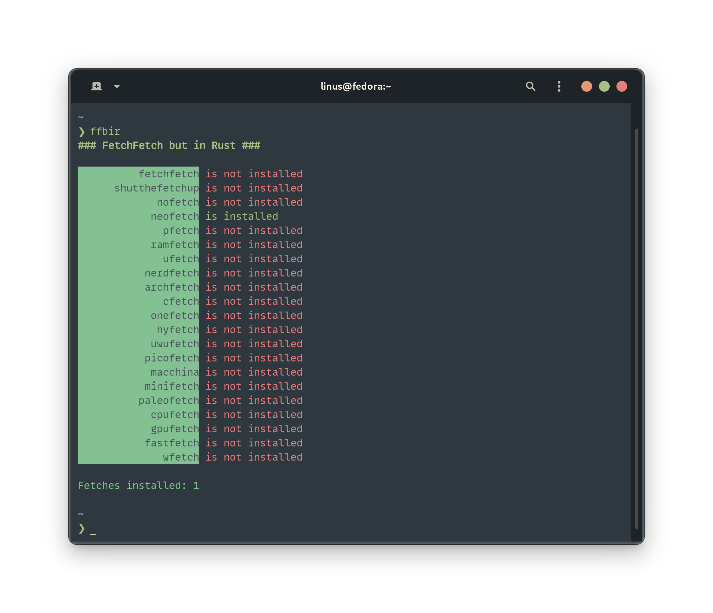

<div align="center">
  <div>
    <h1>fetchfetch, but in rust</h1>
    <p>Fetch all of your fetches. written in <s>go</s> rust.</p>
    
    
    
    
    
</div>
</div>

## 1 - Requirements
`rust` - building ffbir

`fpm` (optional) - packaging the binary

`just` (optional) - easy installation process

## 2 - Install from Binary
Just grab the latest [release](https://github.com/underthefoxtree/ffbir/releases)

## 2 - Just Install (from source)
Install using [just](https://github.com/casey/just)
```bash
$ just install
```

## 2 - Other Install Options (from source)
### 2.1 - Build
```bash
$ cargo build --release
```

### 2.2 - Install
There are multiple options for installation.
#### Manual
```bash
$ sudo cp target/release/ffbir /usr/bin
```

#### Using Package Manager
Build the package
```bash
# Red Hat based systems
$ fpm -t rpm

# Debian/Ubuntu based systems
$ fpm -t deb

# Arch based systems
$ fpm -t pacman

# Universal self-extracting script
$ fpm -t sh
```
Install it using your package manager.

## 3 - Just Uninstall
ONLY use this if you installed using just.
```bash
$ just uninstall
```

## 3 - Other Uninstall Options
#### Package Manager Installation
Use this if you installed using fpm from source or from releases.

Use your package manager to uninstall.

#### Manual Installation
Use this if you built and installed manually.
```bash
$ sudo rm /usr/bin/ffbir
```
